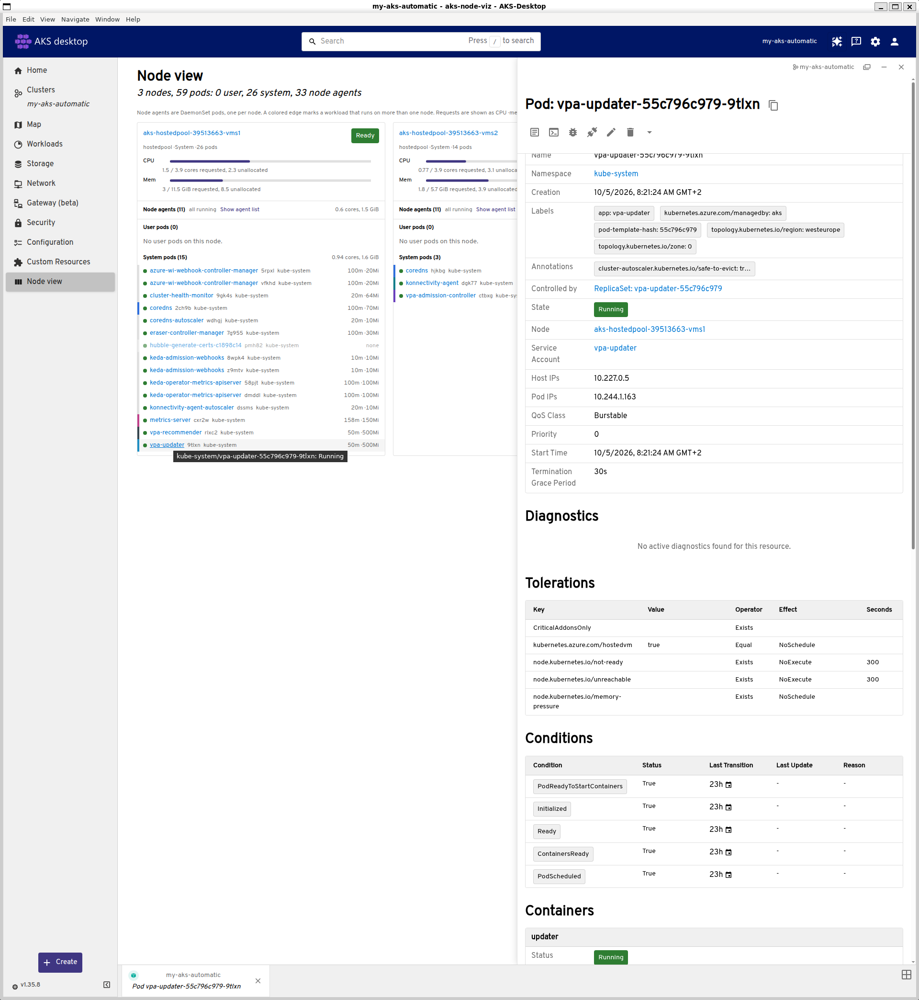

# aks-viz

A proof of concept: a Headlamp plugin for AKS Desktop that shows which pods run on which node, one node pool at a time.



## What it does

A sidebar entry, Node view, opens a page per cluster. You pick a node pool; NAP (Karpenter) pools and AKS agent pools are both recognized. Each node in the pool gets a column with:

- Node status: Ready, NotReady or Cordoned.
- CPU and memory requests against allocatable, calculated the way `kubectl describe node` does.
- Pods grouped as node agents (DaemonSet pods, collapsed), user pods and system pods, each with a status dot and requests. Clicking a pod opens Headlamp's pod details.
- A colored edge on workloads that run on more than one node.

Lists are watched live and limited to the selected cluster. If a list fails, for example with HTTP 403, the page shows what failed and which RBAC permission is missing, and leaves out the numbers that depend on it.

## How it started

On AKS Automatic, a node's page in AKS Desktop shows its YAML and events. This plugin answers the question: what is on this node, and how full is it?

Ten years ago, Docker Swarm Visualizer (https://github.com/dockersamples/docker-swarm-visualizer) answered it for Swarm: one column per node, one card per task. Its capabilities served as requirements. AKS Desktop (https://github.com/Azure/aks-desktop) is built on Headlamp (https://headlamp.dev), so a Headlamp plugin runs inside it and uses the signed-in user's own cluster credentials.

Background in docs/: requirements.md maps the Swarm visualizer's capabilities to Kubernetes and lists what this proof of concept covers; plugin-platform.md explains how AKS Desktop builds and loads plugins.

## Dev setup

Tested on Linux (WSL) with AKS Desktop 0.10.0 installed from the .deb package, Node 24 and npm 12.

1. In AKS Desktop, turn on Settings > Plugins > Plugin Development Mode.
2. Build and install:

   ```
   cd plugin
   npm ci
   npm run install:aks-desktop
   ```

   This builds `dist/main.js` and copies it with `package.json` to `~/.config/AKS-Desktop/plugins/aks-node-viz/` (or `~/.local/share/AKS-Desktop/plugins/` if that directory exists). Set `AKS_DESKTOP_PLUGINS_DIR` to install somewhere else.
3. Reload the AKS Desktop window or restart it, then check that aks-node-viz is enabled under Settings > Plugins.

Tests and checks: `CI=true npm test`, `npm run tsc`, `npm run lint`. More detail is in plugin/README.md.

RBAC needed: list and watch on nodes and pods in all namespaces.
